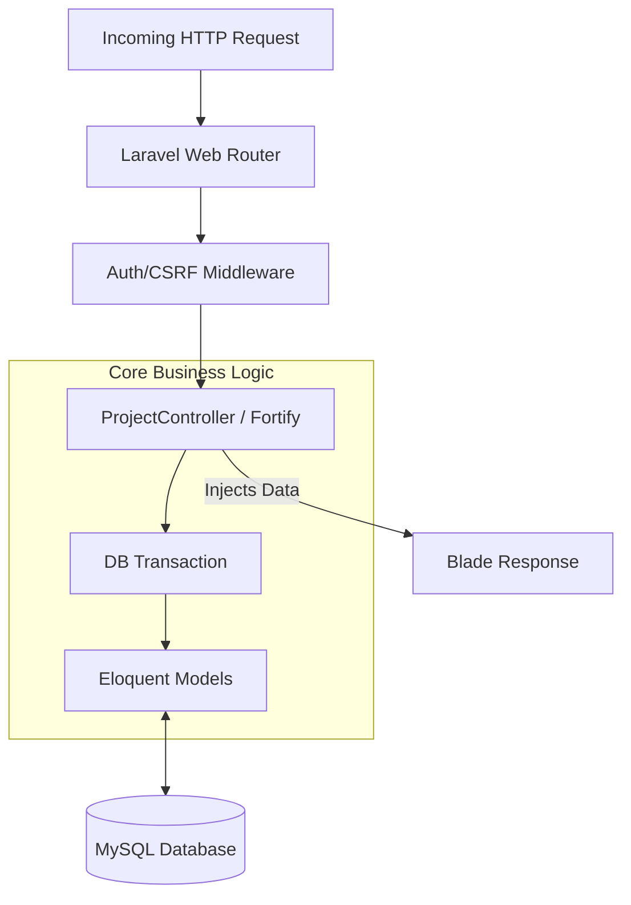

# ⚙️ eAppointment Care — Backend

The backend of **eAppointment Care** provides the robust business logic, secure authentication, database operations, and critical appointment-management functionality that powers the entire healthcare platform. Built on the Laravel framework, it ensures data integrity, prevents scheduling conflicts, and provides a seamless server-rendered experience.

---

## 📌 Overview

The backend acts as the core engine of the application. Because eAppointment Care utilizes a monolithic architecture, the backend directly serves and populates the frontend views:

```text
Frontend (Blade/Alpine.js)
           ↓
Backend Controllers (Laravel/PHP)
           ↓
Database (MySQL)
```

---

## ✨ Key Features

### Authentication & Security

- **Patient Registration & Login**: Secure credential-based authentication using Laravel Fortify.
- **Password Hashing**: Automatic Bcrypt hashing for all passwords.
- **Session Management**: Secure, HTTP-only session cookies and Two-Factor Authentication (2FA) support via Jetstream.

### Patient Management

- **Profile Management**: Backend logic to update patient details including DOB, blood group, and contact information.
- **Booking History**: Retrieves and formats the patient's past and pending appointment bookings.

### Appointment Management

- **Concurrency Protection**: Utilizes pessimistic database locking (`lockForUpdate`) within database transactions to ensure an appointment slot cannot be double-booked by concurrent users.
- **Create Booking**: Validates incoming appointment requests and maps them to a specific patient and doctor.
- **Cancel Booking**: Allows patients to safely cancel their pending appointments, freeing up the slot.

_(Note: Doctor/Admin specific dashboards are planned as future improvements. The current backend logic focuses heavily on the patient booking experience and core data relationships.)_

---

## 🏗️ Backend Architecture



---

## 🗄️ Database

The system relies on a relational schema mapped via Laravel's Eloquent ORM.

| Model           | Purpose                                                                                    |
| --------------- | ------------------------------------------------------------------------------------------ |
| **User**        | Manages patient credentials, 2FA secrets, and personal information (email, DOB, phone).    |
| **Department**  | Represents a hospital department (e.g., Cardiology).                                       |
| **Doctor**      | Represents a healthcare provider, linked to a specific `Department` via foreign key.       |
| **Appointment** | Represents a pre-defined time slot for a specific `Doctor`. Tracks if the slot is `taken`. |
| **Booking**     | Represents a reservation made by a `User` for an `Appointment`. Tracks approval `status`.  |

---

## 🔐 Authentication & Authorization

Authentication is handled securely by **Laravel Jetstream** and **Fortify**:

- **Registration/Login**: Handled securely via Fortify's pre-built controller logic.
- **Password Hashing**: Passwords are automatically hashed using Bcrypt before insertion.
- **Authentication Middleware**: Key application routes are guarded by the `auth` middleware. If an unauthenticated request attempts to access a protected route (like booking an appointment), it is redirected.
- **Authorization**: The backend ensures that users can only view or cancel _their own_ bookings by filtering database queries against `Auth::id()`.

---

## 📅 Appointment Management

The appointment booking process is carefully orchestrated to ensure data integrity:

```text
Patient requests to book an Appointment Slot
                   ↓
Backend validates request (checks if Appointment ID exists)
                   ↓
Initiates Database Transaction
                   ↓
Locks the specific Appointment row (Pessimistic Locking)
                   ↓
Checks if `taken` is true OR if a `Booking` already exists
                   ↓
If available: Creates Booking (Pending) & Marks Appointment as Taken
                   ↓
Commits Transaction & Flashes Success Message
```

---

## 📡 Routing Overview

Because this is a server-rendered application, the backend primarily exposes Web Routes (`routes/web.php`) rather than a separated REST API.

| Route                        | Method | Middleware | Purpose                                                             |
| ---------------------------- | ------ | ---------- | ------------------------------------------------------------------- |
| `/`                          | GET    | None       | Retrieves and displays all `Department` records                     |
| `/appointments/{department}` | GET    | `auth`     | Retrieves available `Appointment` slots for doctors in a department |
| `/bookAppointments`          | POST   | `auth`     | Processes the transaction to book an appointment                    |
| `/my-bookings`               | GET    | `auth`     | Retrieves the authenticated user's `Booking` history                |
| `/cancel-booking`            | POST   | `auth`     | Validates and deletes a pending `Booking`                           |

---

## 🛠️ Technology Stack

<p align="center">
  
  
  
</p>

| Technology            | Purpose                                                                |
| --------------------- | ---------------------------------------------------------------------- |
| **PHP (8.x)**         | Core server-side programming language                                  |
| **Laravel (8.x)**     | Primary backend PHP framework                                          |
| **MySQL**             | Relational database management system                                  |
| **Eloquent ORM**      | Object-Relational Mapper for database interactions                     |
| **Laravel Jetstream** | Application scaffolding for authentication and profile management      |
| **Laravel Fortify**   | Headless authentication backend                                        |
| **Sanctum**           | API token management (configured, but web sessions are primarily used) |

---

## 📁 Project Structure

```text
HMS-app/
├── app/
│   ├── Http/
│   │   ├── Controllers/        # Business logic (ProjectController)
│   │   └── Middleware/         # Custom & framework request filters
│   ├── Models/                 # Eloquent Database Models
│   └── Providers/              # Service Providers
├── config/                     # Application & database configurations
├── database/
│   ├── migrations/             # Schema definitions for DB tables
│   └── seeders/                # Sample data generation (Doctors/Appointments)
├── routes/
│   ├── api.php                 # API route definitions
│   └── web.php                 # Web route definitions
├── tests/                      # Unit and Feature tests
├── .env.example                # Environment variables template
└── composer.json               # PHP Dependencies
```

---

## 🔑 Environment Variables

The backend relies on the `.env` file for configuration. Keep this file secure and out of version control.

```env
APP_NAME="eAppointment Care"
APP_ENV=local
APP_KEY=base64:your_generated_app_key
APP_DEBUG=true
APP_URL=http://localhost:8000

# Database Configuration
DB_CONNECTION=mysql
DB_HOST=127.0.0.1
DB_PORT=3306
DB_DATABASE=your_database_name
DB_USERNAME=your_database_user
DB_PASSWORD=your_database_password
```

---

## 🚀 Getting Started

Follow these steps to configure and run the backend server locally.

### Prerequisites

- PHP (v7.3 or v8.0+)
- Composer
- MySQL Server

### 1. Installation

Clone the repository and install PHP dependencies:

```bash
composer install
```

### 2. Environment Setup

Copy the example environment file and generate a unique application key:

```bash
cp .env.example .env
php artisan key:generate
```

### 3. Database Configuration

Update the `DB_*` variables in your `.env` file to match your local MySQL credentials. Then, run the database migrations:

```bash
php artisan migrate
```

_(Optional: Run `php artisan db:seed` if you have seeders configured to populate initial Doctors and Appointments)._

### 4. Start the Server

Launch the local development server:

```bash
php artisan serve
```

The backend will now be serving requests at `http://localhost:8000`.

---

## 🔒 Security

- **Pessimistic Locking**: Prevents race conditions during the critical appointment booking phase using `->lockForUpdate()`.
- **SQL Injection Protection**: Eloquent ORM utilizes PDO parameter binding to protect all queries.
- **CSRF Protection**: All state-changing routes (`POST`, `PUT`, `DELETE`) are protected by a CSRF token requirement.
- **Strict Validation**: Incoming request payloads are validated using Laravel's `$request->validate()` before processing.
- **Mass Assignment Protection**: Eloquent models explicitly define `$fillable` arrays to prevent unauthorized data injection.

---

## 📄 License

Currently, no license is explicitly specified in the repository. Please refer to the repository owner for usage rights and permissions.
