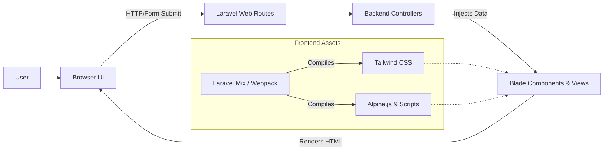

# 🏥 eAppointment Care — Frontend

The frontend for **eAppointment Care** provides a modern, responsive, and intuitive interface for patients to manage their healthcare appointments. Built seamlessly into a Laravel TALL-stack architecture, it focuses on delivering a fast user experience by combining server-rendered views with lightweight client-side interactivity.

## 📌 Overview

The frontend serves as the digital front door for the healthcare system:

- **For Patients**: Provides an easy-to-use interface for browsing hospital departments, viewing available doctors, and securely booking or canceling appointments. It also includes comprehensive profile and session management.
- **For Doctors**: _(Planned)_ Will provide a dashboard for managing schedules and viewing patient details.
- **For Administrators**: _(Planned)_ Will provide tools for user management, doctor onboarding, and system monitoring.

_(Currently, the frontend is actively tailored to the Patient experience.)_

---

## ✨ Features

### Patient Interface

- **Registration & Login**: Secure authentication flows including Two-Factor Authentication (2FA) and password recovery.
- **Department & Doctor Browsing**: Visual directories of hospital departments and associated doctors.
- **Appointment Booking**: Intuitive selection of available time slots and immediate booking confirmation.
- **Booking Management**: A dedicated dashboard (`/my-bookings`) to view pending and approved appointments, with the ability to cancel pending requests.
- **Profile Management**: Update personal information, date of birth, blood group, contact details, and profile photos.
- **Session Management**: View and revoke active browser sessions.

_(Note: Doctor and Admin interfaces are planned for future frontend iterations.)_

---

## 🧭 Application Routes

The frontend relies on Laravel's web routing, providing server-rendered pages directly to the browser:

| Route                        | Purpose                                            | Access        |
| ---------------------------- | -------------------------------------------------- | ------------- |
| `/`                          | Homepage showing all hospital departments          | Public        |
| `/login`                     | User authentication login page                     | Public        |
| `/register`                  | New patient registration page                      | Public        |
| `/appointments/{department}` | Shows available doctors and slots for a department | Authenticated |
| `/bookAppointments`          | Endpoint handling appointment submissions          | Authenticated |
| `/my-bookings`               | Dashboard showing the user's booking history       | Authenticated |
| `/cancel-booking`            | Endpoint handling cancellation of pending bookings | Authenticated |
| `/user/profile`              | Jetstream profile management dashboard             | Authenticated |

---

## 🔄 User Interface Workflow

```text
Patient Registration / Login
          ↓
Homepage (View Departments)
          ↓
Select Department
          ↓
View Doctors & Available Time Slots
          ↓
Select Date/Time & Book Appointment
          ↓
Flash Message Confirmation (Success/Error)
          ↓
"My Bookings" Dashboard (Status: Pending/Approved)
```

---

## 🛠️ Technology Stack

The frontend is built on the monolithic **TALL** stack (Tailwind, Alpine, Laravel, Livewire).

<p align="center">
  
  
  
  
  
</p>

| Technology           | Purpose                                                                            |
| -------------------- | ---------------------------------------------------------------------------------- |
| **Blade Templates**  | Laravel's powerful server-side templating engine                                   |
| **Tailwind CSS**     | Utility-first CSS framework for responsive, custom styling                         |
| **Alpine.js**        | Lightweight JavaScript framework for client-side interactivity (modals, dropdowns) |
| **Laravel Livewire** | Dynamic component rendering (utilized by Jetstream for profile features)           |
| **Laravel Mix**      | Webpack wrapper for compiling CSS and JavaScript assets                            |
| **Axios**            | HTTP client for making API requests (bundled by default)                           |

---

## 🏗️ Frontend Architecture



---

## 📁 Project Structure

The frontend files are tightly integrated into the standard Laravel directory structure:

```text
HMS-app/
│
├── package.json               # Node.js dependencies & NPM scripts
├── tailwind.config.js         # Tailwind CSS configuration and theme settings
├── webpack.mix.js             # Laravel Mix (Webpack) build instructions
│
├── public/                    # Compiled, public-facing assets
│   ├── css/app.css            # Compiled Tailwind CSS
│   ├── js/app.js              # Compiled Alpine.js/JavaScript
│   └── assets/                # Static assets (e.g., logo.png)
│
└── resources/
    ├── css/app.css            # Tailwind directives
    ├── js/app.js              # Alpine.js bootstrap
    └── views/                 # Blade HTML templates
        ├── auth/              # Registration, Login, Password Reset pages
        ├── layouts/           # Master layouts (app.blade.php, guest.blade.php)
        ├── profile/           # Jetstream user profile components
        ├── vendor/            # Published vendor components (Jetstream, Mail)
        ├── appointments.blade.php
        ├── dashboard.blade.php
        ├── index.blade.php
        └── myBookings.blade.php
```

---

## 🔗 API Integration

Because this is a server-rendered application, the frontend primarily communicates with the backend via **standard HTTP form submissions** and CSRF-protected POST requests rather than RESTful API polling.

- Data fetching occurs on the server before the view is rendered.
- Success and validation errors are returned via Laravel's Session Flash Data and displayed directly within the Blade views using conditional rendering.

---

## 🔐 Authentication

Frontend authentication and session states are powered by Laravel Jetstream.

- **Login/Registration**: Pre-built, customizable Blade views under `resources/views/auth/`.
- **Protected Routes**: Views like `myBookings` and `appointments` require an active authenticated session. If an unauthenticated user attempts to access them, they are automatically redirected to `/login`.
- **Role-Based UI**: While roles (Admin/Doctor) are planned, the current UI is globally structured for the Patient role.
- **Token/Session Handling**: Handled entirely via secure HTTP-only session cookies; the frontend does not manually store JWTs in local storage.

---

## 🎨 UI & Design

- **CSS Framework**: Tailwind CSS (v3).
- **Responsive Design**: Mobile-first utility classes ensure the UI adapts from mobile screens up to large desktop monitors.
- **Components**: Highly reusable Blade components (e.g., `<x-app-layout>`, `<x-jet-button>`) ensure design consistency across the application.
- **Typography**: Integrates `@tailwindcss/typography` and `@tailwindcss/forms` for clean, accessible text and input fields. Default font family is set to _Nunito_.

---

## 🚀 Getting Started

To run and compile the frontend locally, ensure you have Node.js and NPM installed, then execute the following commands from the root of the project:

```bash
# Install frontend dependencies
npm install

# Compile assets for development and watch for changes
npm run dev

# Alternatively, just watch for file changes
npm run watch
```

_(Note: You must also have the backend Laravel server running via `php artisan serve` to view the application.)_

---

## 🔑 Environment Variables

The frontend build process doesn't heavily rely on separate environment variables, but standard Laravel Mix variables can be defined in your `.env` file if needed for advanced asset compilation (e.g., overriding asset URLs).

```env
MIX_APP_URL="${APP_URL}"
```

---

## 📦 Production Build

Before deploying to a production server, you must compile and minify the frontend assets to ensure optimal loading speeds:

```bash
npm run prod
# or
npm run production
```

---

## 📄 License

Currently, no license is explicitly specified in the repository. Please refer to the repository owner for usage rights and permissions.
