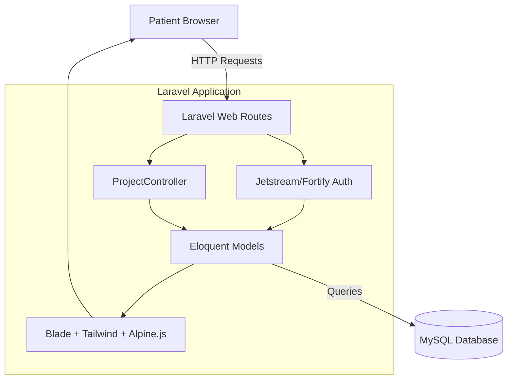

# 🏥 eAppointment Care

> A modern healthcare appointment management platform connecting patients and healthcare providers through a streamlined digital experience.

**🚀 Live Demo:** [https://eappointment-backend-u3tm.onrender.com/](https://eappointment-backend-u3tm.onrender.com/)

## 📌 Overview

**eAppointment Care** is a digital healthcare appointment management system built to simplify the process of scheduling medical visits. The platform allows patients to register, explore hospital departments, view available doctors, and seamlessly book appointments. By transitioning from manual scheduling to a digital workflow, eAppointment Care improves patient experience, reduces scheduling conflicts, and provides a clear overview of upcoming medical appointments.

This system is currently designed primarily for **Patients**, offering a straightforward and intuitive dashboard to manage their healthcare bookings in one place.

---

## ✨ Key Features

### 👤 Patient Features

- **User Authentication**: Secure patient registration and login system with Two-Factor Authentication (2FA) support.
- **Profile Management**: Update personal details, date of birth, blood group, contact number, and profile photo.
- **Department Browsing**: View available hospital departments and their specialties.
- **Doctor Directory**: View available doctors, their qualifications, and their associated departments.
- **Appointment Booking**: Browse available appointment slots for specific doctors and securely book them.
- **Booking Management**: View the history of booked appointments, check their approval status (Pending/Approved), and cancel pending appointments.

_(Note: Admin and Doctor specific dashboards are planned for future releases. Currently, the application focuses on the patient-facing booking experience.)_

---

## 🔄 How the System Works

```text
Patient Registration / Login
             ↓
Browse Hospital Departments
             ↓
View Available Doctors & Schedules
             ↓
Select an Available Appointment Slot
             ↓
Confirm Booking Request
             ↓
Booking Created (Status: Pending)
             ↓
Patient Views or Cancels Booking from Dashboard
```

---

## 🏗️ System Architecture



---

## 🧩 Project Structure

```text
HMS-app/
│
├── app/
│   ├── Http/Controllers/    # Application controllers (e.g., ProjectController)
│   └── Models/              # Eloquent database models (User, Doctor, Booking, etc.)
│
├── database/
│   ├── migrations/          # Database schema definitions
│   └── seeders/             # Database seeders
│
├── public/
│   └── assets/              # Static assets (e.g., logo.png)
│
├── resources/
│   └── views/               # Blade templates, UI components, and layouts
│
├── routes/
│   ├── api.php              # API endpoints
│   └── web.php              # Web application routes
│
├── .env.example             # Environment configuration template
├── composer.json            # PHP dependencies
├── package.json             # Node.js dependencies
└── tailwind.config.js       # Tailwind CSS configuration
```

---

## 🛠️ Technology Stack

<p align="center">
  
  
  
  
  
</p>

| Layer              | Technology                  | Purpose                                                      |
| ------------------ | --------------------------- | ------------------------------------------------------------ |
| **Frontend**       | Blade Templates, Alpine.js  | Server-rendered UI and lightweight client-side interactivity |
| **Styling**        | Tailwind CSS                | Utility-first responsive styling and UI components           |
| **Backend**        | Laravel 8 (PHP)             | Core application logic, routing, and MVC architecture        |
| **Database**       | MySQL                       | Relational data storage                                      |
| **Authentication** | Laravel Jetstream & Fortify | Secure user authentication, session management, and 2FA      |

---

## 🔐 Authentication & Authorization

The platform utilizes **Laravel Jetstream** (powered by Fortify and Sanctum) to handle secure user authentication.

- **Registration & Login**: Secure credential-based access with encrypted passwords.
- **Session Management**: Authenticated sessions to protect user-specific routes.
- **Protected Routes**: Key application features, such as viewing and booking appointments (`/bookAppointments`, `/my-bookings`), are strictly guarded by the `auth` middleware, ensuring only logged-in patients can access them.
- **Two-Factor Authentication**: Optional added security layer for patient accounts.

---

## 📅 Appointment Workflow

1. **Availability**: Administrators/System seeders populate the `appointments` table with available time slots for specific doctors and departments.
2. **Booking**: A patient selects an available appointment slot. The system locks the row using database transactions (`lockForUpdate`) to prevent double-booking.
3. **Confirmation**: A new record is created in the `bookings` table with a `pending` status, and the original appointment slot is marked as `taken`.
4. **Management**: The patient can view their bookings on the "My Bookings" page. If an appointment is still pending, the patient can safely cancel it.

---

## 🗄️ Database

The system relies on a relational database schema mapped via Laravel Eloquent models:

| Entity          | Purpose                                                                                         |
| --------------- | ----------------------------------------------------------------------------------------------- |
| **User**        | Stores patient details, authentication credentials, and profile information (DOB, blood group). |
| **Department**  | Represents hospital departments (e.g., Cardiology, Neurology).                                  |
| **Doctor**      | Stores doctor profiles and qualifications, linked to a specific Department.                     |
| **Appointment** | Pre-defined available time slots for doctors.                                                   |
| **Booking**     | The actual reservation made by a User for a specific Appointment.                               |

---

## 🔗 Frontend–Backend Communication

The application uses a monolithic Server-Side Rendering (SSR) approach.

- The frontend communicates with the backend via standard HTTP `GET` and `POST` requests.
- Form submissions (like booking or canceling an appointment) use CSRF protection.
- The backend `ProjectController` handles business logic, interacts with the database, and returns populated Blade views.
- Success and error messages are flashed to the session and rendered as alerts on the frontend.

---

## 📡 API Overview

Currently, the application relies on Web Routes rather than REST API endpoints for its core functionality:

| Route                        | Method | Purpose                                                  | Middleware |
| ---------------------------- | ------ | -------------------------------------------------------- | ---------- |
| `/`                          | GET    | Displays all available hospital departments              | None       |
| `/appointments/{department}` | GET    | Displays available appointments/doctors for a department | `auth`     |
| `/bookAppointments`          | POST   | Handles the submission of a new appointment booking      | `auth`     |
| `/my-bookings`               | GET    | Displays the logged-in patient's booking history         | `auth`     |
| `/cancel-booking`            | POST   | Cancels a specific pending booking                       | `auth`     |

---

## 🚀 Getting Started

Follow these steps to run the project locally on your machine.

### Prerequisites

- PHP (v7.3 - v8.0+)
- Composer
- Node.js & npm
- MySQL Server

### 1. Clone the Repository

```bash
git clone <repository-url>
cd HMS-app
```

### 2. Backend Setup (Laravel)

Install the PHP dependencies:

```bash
composer install
```

Copy the environment template and generate the application key:

```bash
cp .env.example .env
php artisan key:generate
```

Configure your database credentials in the `.env` file, then run the database migrations:

```bash
php artisan migrate
```

### 3. Frontend Setup (Tailwind & Mix)

Install Node.js dependencies and compile the frontend assets:

```bash
npm install
npm run dev
```

### 4. Run the Application

Start the local Laravel development server:

```bash
php artisan serve
```

The application will be accessible at `http://localhost:8000`.

---

## 🔑 Environment Variables

The application requires environment variables to be configured in the `.env` file. Do not expose your actual `.env` file in version control.

```env
APP_NAME="eAppointment Care"
APP_ENV=local
APP_KEY=base64:your_generated_app_key
APP_DEBUG=true
APP_URL=http://localhost:8000

DB_CONNECTION=mysql
DB_HOST=127.0.0.1
DB_PORT=3306
DB_DATABASE=your_database_name
DB_USERNAME=your_database_user
DB_PASSWORD=your_database_password
```

---

## 🔒 Security

- **Password Hashing**: User passwords are automatically hashed using Bcrypt before being saved to the database.
- **CSRF Protection**: All form submissions (POST requests) are protected by Laravel's built-in CSRF tokens.
- **Route Protection**: The `auth` middleware prevents unauthorized access to sensitive pages.
- **Race Condition Prevention**: Database transactions and pessimistic locking (`lockForUpdate`) are used during the booking process to ensure an appointment cannot be double-booked by concurrent users.
- **Input Validation**: Server-side validation is strictly enforced for incoming requests (e.g., verifying if the `appointment_id` actually exists).

---

## 🎯 Project Goals

- **Simplify Appointment Booking**: Provide a frictionless digital experience for patients to find doctors and book appointments.
- **Digitize Records**: Move away from manual, paper-based scheduling towards a reliable digital database.
- **Improve Accuracy**: Prevent double-booking through robust backend validation and database locks.

---

## 🔮 Future Improvements

While the patient-facing booking system is fully operational, the following features are planned for future development:

- **Admin Dashboard**: A dedicated panel for hospital administrators to manage departments, add new doctors, and approve/reject pending bookings.
- **Doctor Portal**: Secure login for doctors to manage their own schedules, view patient histories, and update appointment statuses.
- **Email/SMS Notifications**: Automated reminders and status updates for patients regarding their bookings.
- **Advanced Search**: Filtering doctors by specialized qualifications, availability, and ratings.

---

## 👨‍💻 Project Information

| Item             | Details                                  |
| ---------------- | ---------------------------------------- |
| **Project Name** | eAppointment Care                        |
| **Type**         | Healthcare Appointment Management System |
| **Frontend**     | Blade, Tailwind CSS, Alpine.js           |
| **Backend**      | Laravel 8 (PHP)                          |
| **Database**     | MySQL                                    |

---

## 📄 License

Currently, no license is specified in the repository. Please refer to the repository owner for usage rights and permissions.
